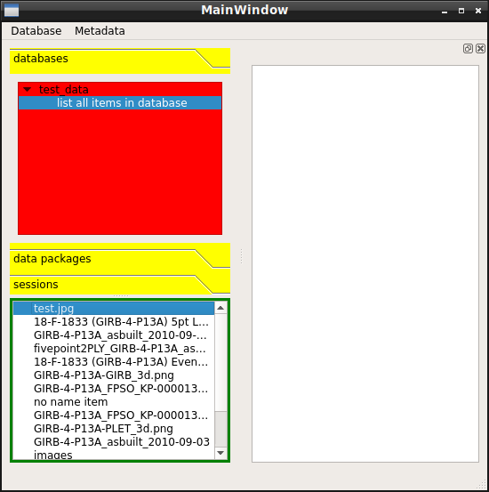
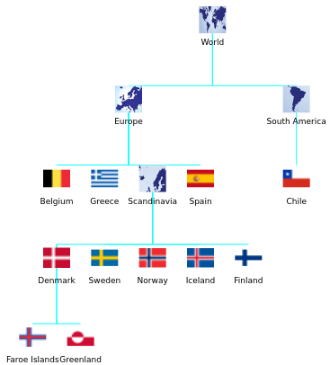
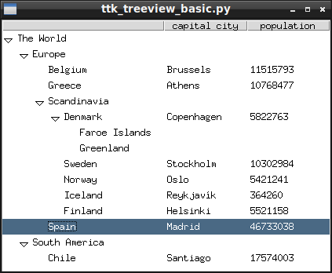
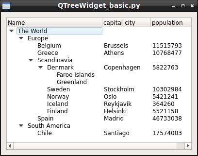
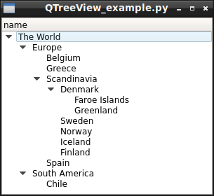

```{r setup, include=FALSE}
options(htmltools.dir.version = FALSE)
library(knitr)
```

```{python, echo=FALSE, results='hide', engine.path='/home/develop/local/anaconda3/envs/py3/bin/python'}
from examples.one_line_tree import onelinetree, show_onelinetree_example
from examples.linked_list import LLnode
from vntree import Node
import pprint
```


# Introduction

### About the speaker

* I'm a chartered mechanical engineer
* 20+ years' experience working in oil & gas subsea engineering
* 15+ years' experience programming in Python
  * also Fortran, Perl, Julia ...
* Presented at PyCon Ireland 2019
  * [pflacs: Faster loadcases and parameter studies](https://qwilka.github.io/talk/2019-10-12_pycon2019/)
* Own start-up company [Qwilka](https://qwilka.github.io/)
  * developing software for data management and analytics
  * targeting unstructured engineering data


???

### References, links

1. Title page photo by [Luke Richardson](https://unsplash.com/s/photos/luke-richardson) on [Unsplash](https://unsplash.com/).


---

class: notitletop

<a href="https://github.com/qwilka/metadata-manager-2015">

</a>

<a href="https://github.com/qwilka/data-visualizer-2015">

</a>

<a href="https://qwilka.github.io/">

</a>

???

### References, links

1. https://qwilka.github.io/
1. https://github.com/qwilka/data-visualizer-2015
1. https://github.com/qwilka/metadata-manager-2015

---

# Introduction

### About the presentation

This presentation is a high-level overview of tree data structures in computing.

With some lower-level details in Python.

### Presentation sides

* Link to slides https://qwilka.github.io/PyCon_Limerick_2020/ 
* The slides are created with [xaringan](https://slides.yihui.org/xaringan).
* Links to resources, references, source code, etc., are in the presentation speaker notes.
  * Press **p** to see speaker notes.
  * Press **h** for slides help.

???

### References, links

1. [xaringan](https://github.com/yihui/xaringan) create slideshows with [remark.js](http://remarkjs.com/) and [R Markdown](https://bookdown.org/yihui/rmarkdown/xaringan.html).


---

# Tree data structure

.pull-left[
* A 'tree' is an connected, ordered, hierarchical data structure 
* Trees consist of units called `nodes`
* Each node is connected to <u>one</u> `parent` node in the level above 
  * the `root` (base) node uniquely has no parent
* A node can be connected to any number of `child` nodes in the level below
  * Nodes without children are called `leaf` nodes
* Trees are recursive, each child node is a sub-tree itself
]

.pull-right[
  
]


???

* a lot of data falls naturally into a hierarchical tree structure.

  * countries and states
  * Organizational charts - organograms https://en.wikipedia.org/wiki/Organizational_chart


Even data that isn't naturally hierarchical can be transformed into a hierarchy.

social and political structures

### References, links

1. [World selection tree](https://github.com/qwilka/PyCon_Limerick_2020/tree/master/examples/Vega) image created with [Vega](https://vega.github.io/vega/docs/transforms/tree/)

---

# Tree modules in Python

* [anytree](https://github.com/c0fec0de/anytree) 
  * simple, lightweight and extensible tree data structure

* [treelib](https://github.com/caesar0301/treelib)
  * an efficient implementation of tree data structure in python 2/3

* [vntree](https://github.com/qwilka/vntree) (presenter's own module)
  * a simple tree data structure in Python
  * development still in alpha-phase


???

### References, links

1. anytree https://github.com/c0fec0de/anytree
1. treelib https://github.com/caesar0301/treelib
1. vntree https://github.com/qwilka/vntree


---

# A very basic list-based tree

.pull-left[
```python
rootnode = list()

europe = list()
rootnode.append(europe)

europe.append("Belgium")
europe.append("Greece")

scandinavia = list()
europe.append(scandinavia)
europe.append("Spain")

denmark = list()
scandinavia.append(denmark)
scandinavia.extend(["Norway", "Sweden", "Iceland", "Finland"])

denmark.extend(["Faroe Islands", "Greenland"])

samerica = list()
rootnode.append(samerica)
samerica.append("Chile")
```
]

--

.pull-right[
```python
pprint.pprint(rootnode, indent=2, width=40)

[ [ 'Belgium',
    'Greece',
    [ ['Faroe Islands', 'Greenland'],
      'Norway',
      'Sweden',
      'Iceland',
      'Finland'],
    'Spain'],
  ['Chile']]

```
]


???

$ python list_tree_simple.py 

### References, links

1. https://github.com/qwilka/PyCon_Limerick_2020/blob/master/examples/list_tree_simple.py


---

# List tree with data

`list-node API: [<node name>: str, <data>: any, <child node>: list-node, ...]`

--

```{python, collapse=TRUE, results='markup', comment="", prompt=TRUE, R.options=list(prompt='>>> ', continue='>>> ')}
root = ["The World", {"population":7762609412}] # define tree root node 
europe = ["Europe", {"population":737000000}]  # define 1st child node
root.append(europe)  # append 1st child node to root node
namerica = ["North America", {"population":367914615}] # define 2nd child node
root.append(namerica)  # append 2nd child node to root node
scandinavia = ["Scandinavia", {"population":31000000}]
europe.append(scandinavia)
scandinavia.append( ["Denmark", {"population":5792202}] )
scandinavia.append( ["Sweden", {"population":10099265}] )
namerica.append( ["Canada", {"population":37742154}] ) 
```

--


```{python, collapse=TRUE, results='markup', comment="", prompt=TRUE, R.options=list(prompt='>>> ', continue='>>> ')}
pprint.pprint(root, indent=4, compact=True)
```

???

### References, links

$ python list_tree_with_data.py

1. https://github.com/qwilka/PyCon_Limerick_2020/blob/master/examples/list_tree_with_data.py

---

# A linked list in Python

.pull-left[
```python
class LLnode:
  def __init__(self, value, prev):
    self.prev = prev
    if prev:
        prev.append(self)
    self.next = () 
    self.value = value

  def append(self, newnode):
    self.next = newnode
    return newnode 

  def __iter__(self):
      ...

  def __reversed__(self):
      ... 

  def show(self):
      ... 
```
]

--

.pull-right[
```{python, collapse=TRUE, results='markup', comment="", prompt=TRUE, R.options=list(prompt='>>> ', continue='>>> ')}
first = LLnode('First Node', None)
sec = LLnode('Second Node', first)
third = LLnode(3, sec)
third.append( LLnode(4.0, None) )
```
{{content}}
]

--

```{python, collapse=TRUE, results='markup', comment="", prompt=TRUE, R.options=list(prompt='>>> ', continue='>>> ')}
for node in first:
    print(node.value)
```
{{content}}

--

```{python, collapse=TRUE, results='markup', comment="", prompt=TRUE, R.options=list(prompt='>>> ', continue='>>> ')}
for node in reversed(first):
    print(node.value)
```
{{content}}


???

### References, links

$ python linked_list.py

1. [Linked list](https://en.wikipedia.org/wiki/Linked_list) article on Wikipedia.
1. [linked_list.py](https://github.com/qwilka/PyCon_Limerick_2020/blob/master/examples/linked_list.py) source code on Github.

---

# Linked List - usage example

```{python, collapse=TRUE, results='markup', comment="", prompt=TRUE, R.options=list(prompt='>>> ', continue='>>> ')}
root = LLnode('Stephen Dedalus', None)
root.append(LLnode('Class of Elements')).append(LLnode('Clongowes Wood College')).append(LLnode('Sallins')).append(LLnode('County Kildare')).append(LLnode('Ireland')).append(LLnode('Europe')).append(LLnode('The World')).append(LLnode('The Universe'))
```

--

```{python, collapse=TRUE, results='markup', comment="", prompt=TRUE, R.options=list(prompt='>>> ', continue='>>> ')}
root.show()
```

--

- A linked list is a degenerate tree, following a single line of decent.

--

- It could be considered as a 'vertical' data structure.

--

- By contrast, an array could be regarded as a 'horizontal' data structure.


---

# A basic tree Node class

.pull-left[
```python
class Node:
  def __init__(self, name, parent, data=None):
    self.name = name
    self.children = []
    self.parent = parent
    if parent: parent.add_child(self)
    self.data = data

  def add_child(self, newnode):
    self.children.append(newnode)
    newnode.parent = self
    return newnode

  def remove_child(self, idx):
    return self.children.pop(idx)

  def copy(self):
    return copy.deepcopy(self) 

  def show(self):
      ... 
```
]

--

.pull-right[
```{python, collapse=TRUE, results='markup', comment="", prompt=TRUE, R.options=list(prompt='>>> ', continue='>>> ')}
root = Node('Root node', None)
child1 = Node('First child', root)
child2 = Node('2nd child', root, {"n":123})
child1.add_child( Node("grand-child", None, {}) )
```
{{content}}
]

--

```{python, collapse=TRUE, results='markup', comment="", prompt=TRUE, R.options=list(prompt='>>> ', continue='>>> ')}
root.show()
```
{{content}}

--

```{python, collapse=TRUE, results='markup', comment="", prompt=TRUE, R.options=list(prompt='>>> ', continue='>>> ')}
for node in root:
    print(node.name)
```
{{content}}


???

### References, links

1. [Linked list](https://en.wikipedia.org/wiki/Linked_list) article on Wikipedia.
1. [linked_list.py](https://github.com/qwilka/PyCon_Limerick_2020/blob/master/examples/linked_list.py) source code on Github.


---

# One Line Tree

.pull-left[
```python
from collections import defaultdict

*def tree(): return defaultdict(tree)

root = tree()
root["The World"]
root["The World"]["population"] = 7762609412
root["The World"]["Europe"]
root["The World"]["Europe"]["Scandinavia"]
root["The World"]["Europe"]["Scandinavia"]["Denmark"]
root["The World"]["Europe"]["Scandinavia"]["Denmark"]["population"] = 5792202
root["The World"]["Europe"]["Scandinavia"]["Sweden"]
root["The World"]["Europe"]["Scandinavia"]["Sweden"]["population"] = 10099265
root["The World"]["North America"]
root["The World"]["North America"]["Canada"]
root["The World"]["North America"]["Canada"]["population"] = 37742154

import json
print(json.dumps(root, indent=2))
```
]


--

.pull-right[
```{python, echo=FALSE, collapse=TRUE, results='markup', comment="", prompt=TRUE, R.options=list(prompt='>>> ', continue='>>> ')}
show_onelinetree_example()
```
]

???

$ python one_line_tree.py

### References, links

1. GitHub Gist [hrldcpr/tree.md](https://gist.github.com/hrldcpr/2012250) «One-line Tree in Python»
1. [Jeff Khupp 2013 article](https://jeffknupp.com/blog/2013/02/14/drastically-improve-your-python-understanding-pythons-execution-model/) describes a similar "auto-vivifying dictionary that operates like a trie"
1. https://github.com/qwilka/PyCon_Limerick_2020/blob/master/examples/one_line_tree.py


---

# Dataclass Tree

.pull-left[
```python
from dataclasses import dataclass, field
from typing import List, Dict, Any


@dataclass
class DataclassNode:
    name: str
    children: List[Any] = field(default_factory=lambda : [])
    data: Dict = field(default_factory=lambda : {})

    def add_child(self, childnode):
        self.children.append(childnode)
        return childnode
    
    def show(self, indent=2, _pre=""):
        print(_pre + self.name)
        for _c in self.children:
            _c.show(indent, _pre=_pre+" "*indent)
```
]

--

.pull-right[
```python
root = DataclassNode("World", data={"population":7762609412})
europe = root.add_child( DataclassNode("Europe") )
scandinavia = europe.add_child( DataclassNode("Scandinavia") )
scandinavia.add_child( DataclassNode("Denmark", data={"population":5792202}) )
scandinavia.add_child( DataclassNode("Sweden", data={"population":10099265}) )
scandinavia.add_child( DataclassNode("Norway", data={"population":5421241}) )
namerica = root.add_child( DataclassNode("North America") )
namerica.add_child( DataclassNode("Canada", data={"population":37742154}) )
root.show()
```
{{content}}
]

--

```python
World
  Europe
    Scandinavia
      Denmark
      Sweden
      Norway
  North America
    Canada
```
{{content}}


???

### References, links

$ python dataclass_tree.py

1. https://github.com/qwilka/PyCon_Limerick_2020/blob/master/examples/dataclass_tree.py


---

# Tree from dictionary (with vntree)

.pull-left[
```python
theworld = {"name":"The World",
  "childs" : [
    {
      "name": "Europe",
      "childs": [
        {
          "name": "Belgium",
          "data": {
              "capital": "Brussels",
              "population": 11515793
          }
        },
        {
          "name": "Greece",
          "data": {
              "capital": "Athens",
              "population": 10768477
          }
        },
...
]]}
```
]

--

.pull-right[
```python
from vntree import Node
dicttree = Node(treedict=theworld)
dicttree.show()
```
{{content}}
]

--

```python
| The World
+--| Europe
.  +--| Belgium
.  .  | Greece
.  .  | Scandinavia
.  .  +--| Denmark
.  .  .  +--| Faroe Islands
.  .  .  .  | Greenland
.  .  .  | Sweden
.  .  .  | Norway
.  .  .  | Iceland
.  .  .  | Finland
.  .  | Spain
.  | South America
.  +--| Chile
```

{{content}}


???

### References, links

$ python json_import.py

1. https://github.com/qwilka/PyCon_Limerick_2020/blob/master/examples/vntree/json_import.py


---

# Tree from JSON (vntree)

.pull-left[
```python
dicttree.to_json("countries.json")

jsontree = Node.from_json("countries.json")
jsontree.show()
```
{{content}}
]

--

```python
| The World
+--| Europe
.  +--| Belgium
.  .  | Greece
.  .  | Scandinavia
.  .  +--| Denmark
.  .  .  +--| Faroe Islands
.  .  .  .  | Greenland
.  .  .  | Sweden
.  .  .  | Norway
.  .  .  | Iceland
.  .  .  | Finland
.  .  | Spain
.  | South America
.  +--| Chile
```


--

.pull-right[
```python
comp = dicttree.tree_compare(jsontree)
print("jsontree round-trip", 
f"\ncomparison with dicttree = {comp}")
```

```
jsontree round-trip
comparison with dicttree = 1.0
```

]

---

# Tree from YAML (vntree)


.pull-left[
```yaml
- !Node &world
  name: The World

- !Node &europe
  name: Europe
  parent: *world

- !Node &belgium
  name: Belgium
  parent: *europe
  data:
    capital: Brussels
    population: 11515793

- !Node &scandinavia
  name: Scandinavia
  parent: *europe

- !Node &denmark
  parent: *scandinavia
  data:
    capital: Copenhagen
    name: Denmark
    population: 5822763
```
]

--

.pull-right[
```python
from vntree import Node
rootnode = Node.yaml2tree("countries.yaml")
rootnode.show()
```
{{content}}
]

--

```python
| The World
+--| Europe
.  +--| Belgium
.  .  | Greece
.  .  | Scandinavia
.  .  +--| Denmark
.  .  .  +--| Faroe Islands
.  .  .  .  | Greenland
.  .  .  | Sweden
.  .  .  | Norway
.  .  .  | Iceland
.  .  .  | Finland
.  .  | Spain
.  | South America
.  +--| Chile
```

???

### References, links

$ python yaml_import.py

1. https://github.com/qwilka/PyCon_Limerick_2020/blob/master/examples/vntree/yaml_import.py


---

# GUI widget - tkinter ttk.Treeview

.pull-left[
```python
from tkinter import *
from tkinter.ttk import *

app = Tk()
tree = Treeview(app)  # tkinter.ttk

root = tree.insert("", 0, text="The World")
europe = tree.insert(root, "end", text="Europe")
tree.insert(europe, "end", text="Belgium", values=("Brussels", 11515793))
tree.insert(europe, "end", text="Greece", values=("Athens", 10768477))
scandinavia = tree.insert(europe, "end", text="Scandinavia")
denmark = tree.insert(scandinavia, "end", text="Denmark", values=("Copenhagen", 5822763))
tree.insert(denmark, "end", text="Faroe Islands")
...

tree.pack(fill=BOTH, expand=True)
app.mainloop()
```
]

.pull-right[
  
]

???

### References, links

% python ttk_treeview_basic.py 

1. https://github.com/qwilka/PyCon_Limerick_2020/blob/master/examples/tkinter/ttk_treeview_basic.py
1. https://github.com/qwilka/PyCon_Limerick_2020/blob/master/examples/tkinter/ttk_treeview_OO.py

---

# PyQt widget - QTreeWidget

.pull-left[
```python
import sys
from PyQt5.QtWidgets import QTreeWidget, QTreeWidgetItem, QApplication, QWidget, QVBoxLayout 

app = QApplication(sys.argv)

tree = QTreeWidget()
...

root = QTreeWidgetItem(tree, ['The World'])
europe = QTreeWidgetItem(root, ['Europe'])
QTreeWidgetItem(europe, ['Belgium', "Brussels", "11515793"])
...

sys.exit(app.exec_())
```
]

.pull-right[
  
]

???

### References, links

1. https://github.com/qwilka/PyCon_Limerick_2020/blob/master/examples/PyQt/QTreeWidget_basic.py
1. https://github.com/qwilka/PyCon_Limerick_2020/blob/master/examples/PyQt/QTreeWidget_OO.py


---

# PyQt widget - QTreeView

.pull-left[
```python
from PyQt5.QtWidgets import QTreeView, QApplication 
from PyQt5.QtCore import QAbstractItemModel, QModelIndex, Qt

class Node:
  def __init__(self, name, parent=None)
  ...

class TreeModel(QAbstractItemModel):
  def __init__(self, rootNode, parent=None)
  ...

app = QApplication(sys.argv)

rootnode = Node("The World")
europe = Node("Europe", rootnode)
Node("Belgium", europe)
...
model = TreeModel(rootnode)

treeView = QTreeView()
treeView.setModel(model)

sys.exit(app.exec_())
```
]

.pull-right[
  
]

???

### References, links

1. https://github.com/qwilka/PyCon_Limerick_2020/blob/master/examples/PyQt/QTreeView_example.py


---

# Decision Tree

.pull-left[

* Tree analysis for decision support
* Based on calculating `expected value` for outcomes
  * EV = NPV * probability
  * consider full range of outcomes
* Best for portfolio of similar assets
  * Risk management
{{content}}
]
--

```python
class DecisionNode(Node):
  def __init__(self, name, parent=None, type="outcome", p=1, npv=0):
  ...
  @staticmethod
  def calculate_ev(node):
  ...

rootnode = DecisionNode("Acquire and drill | Do not acquire?", type="decision")
No_acq = DecisionNode("Do not acquire lease", rootnode, npv=0)
tw1_chance = DecisionNode("Acquire and drill", rootnode, type="chance")
tw1_large = DecisionNode("Large field", tw1_chance, p=0.05, npv=360)
...
```


--

.pull-right[
```python
list(map(rootnode.calculate_ev, reversed(rootnode)))
print(rootnode.to_texttree())

□---Acquire and drill | Do not acquire?; DECISION: «Acquire and drill»
    |
.   |---Do not acquire lease; p=1; NPV=0; EV=0
.   ◯---Acquire and drill; EV=15.625
.   .   ▷---Large field; p=0.05; NPV=360; EV=18.0
.   .   ▷---Marginal field; p=0.05; NPV=110; EV=5.5
.   .   ▷---Dry hole; p=0.9; NPV=-8.75; EV=-7.875
            |
.   .   .   □---Drill test well #2 | drop?; DECISION: «Drill test well #2»
                |
.   .   .   .   ◯---Drill test well #2; EV=-8.75
.   .   .   .   .   ▷---Large field; p=0.075; NPV=350; EV=26.25
.   .   .   .   .   ▷---Marginal field; p=0.075; NPV=100; EV=7.5
.   .   .   .   .   ▷---Dry hole; p=0.85; NPV=-50; EV=-42.5
.   .   .   .   |---Drop; p=1; NPV=-40; EV=-40
```

]


???

### References, links

$ python decision_tree.py

1. https://en.wikipedia.org/wiki/Decision_tree
1. [Decision Analysis in Cost Engineering](http://www.maxvalue.com/DA_in_CE_20170329.pdf) John Schuyler, 2015


---
class: middle, center, notitletop
background-image: url(assets/Darwin_Tree_1837.png)
background-size: cover

.large[**https://qwilka.github.io/PyCon_Limerick_2020/**]


???

### References, links

1. General references.
